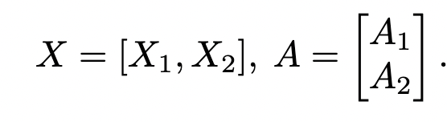
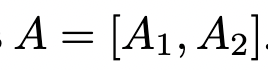

# Megatron论文阅读

## Tranformer结构

-      

 

## GEMM+GELU的并行

### 方案一

-     

- Y = GeLU(X1A1+X2A2)    
- GeLU(X1A1+X2A2]) != GeLU(X1A1)+GeLU(X2A2) (因为非线性)    

### 方案二

-    

- [Y1,Y2] = [GeLU(X1A1),GeLU(X2A2)]   

     

**论文中给出的切割方式，A矩阵列切割，B矩阵行切割**   

## Self-Attention的并行   

    

**Attention 每个头的计算在一个 gpu 上**

### 参考资料

https://zhuanlan.zhihu.com/p/622212228