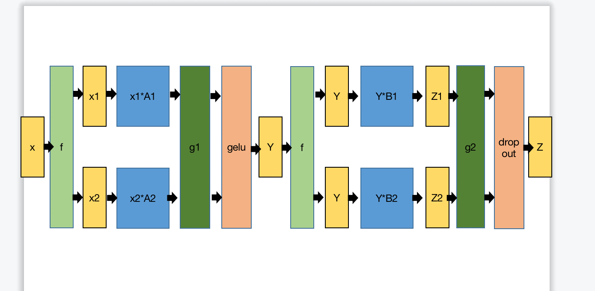

# 用 megatron 的方式改写 opt 模型

## opt 模型的结构

opt 模型结构类似GPT模型的结构，由多个 transformer 解码器（如下图所示）堆叠而成。所以我们主要要解决的是 Mlp 和 Masked Multi Self Attention的模型并行。      


​          

### Masked Multi Self Attention的并行   

```python
import torch 
from torch import nn 
import torch.distributed as dist
from torch.distributed import ReduceOp

class ScaledDotProductAttention(nn.Module):

    def __init__(self, temperature, attn_dropout=0.1):
        super().__init__()
        self.temperature = temperature
        self.dropout = nn.Dropout(attn_dropout)

    def forward(self, q, k, v, mask=None):

        attn = torch.matmul(q / self.temperature, k.transpose(1, 2))

        if mask is not None:
          attn = attn.masked_fill(mask == 0, -1e9)

        attn = self.dropout(F.softmax(attn, dim=-1))
        output = torch.matmul(attn, v)
        return output, attn

class Mutihead_Attention(nn.Module):
    def __init__(self):
        super(Mutihead_Attention, self).__init__()

        self.w_q = nn.Linear(input_size, k_size/head_num , bias=False)
        self.w_k = nn.Linear(input_size, k_size/head_num , bias=False)
        self.w_v = nn.Linear(input_size, v_size/head_num , bias=False)
        self.attention = ScaledDotProductAttention(temperature=self.d_k ** 0.5)
        self.fc = nn.linear(v_size/head_num, output_size)

    def forward(self, x, mask):
        #b x lq x dv
        q = self.w_q(x)
        k = self.w_k(x)
        v = self.w_v(x)
        if mask is not None:
          mask = mask.unsqueeze(1)   

        out, attn = self.attention(q, k, v, mask=mask)
        #每个 head 在一个 gpu 上计算，最后通信
		out = out*self.fc(out)
        
        dist.all_reduce(out, op=ReduceOp.SUM)
        return out   
```

### MLP的并行  

```python
import torch 
from torch import nn 
import torch.distributed as dist
from torch.distributed import ReduceOp
#行拆分
class TPRowLR(nn.Module):
    def __init__(self):
        super(TPRowLR, self).__init__()
        self.fc = nn.Linear(input_size, output_size/gpu_num)
    def forward(self, x):
        out = self.fc(x)
        out_tensor_list = [ torch.zeros_like(out).to(device) for i in range(gpu_num)]
        out_tensor_list [torch.local_rank()] = out
        dist.all_gather(out_tensor_list, out)
        out = torch.cat(out_tensor_list,axis=-1)
        return out
#列拆分
class TPColLR(nn.Module):
    def __init__(self):
        super(TPColLR, self).__init__()
        self.fc = nn.Linear(input_size/gpu_num, output_size)
    def forward(self, x):
        out = self.fc(x)
        dist.all_reduce(out, op=ReduceOp.SUM)
        return out
      
```

**megatron中提供的 mlp 并行方式**

```python
import torch 
from torch import nn 
import torch.distributed as dist
from torch.distributed import ReduceOp
class MLP_Megatron(nn.Module):
    def __init__(self):
        super(MLP_Megatronnn, self).__init__()
        self.fc1 = nn.Linear(input_size, hidden_size/gpu_num)
        self.gelu = F.gelu()
        self.fc2 = nn.Linear(hidden_size/gpu_num, output_size)
        self.dropout =  nn.Dropout(p=0.5)  
    def forward(self, x):
        out = self.fc1(x)
        out = self.gelu(out)
		out = self.fc2(out)
        out = self.dropout(out)
        dist.all_reduce(out, op=ReduceOp.SUM)
        return out
```

## 通讯分析


如上图所示，采用 megatron-lm 中的方式，mlp 和 attention 的两个模块的矩阵乘法均采用先列拆分再行拆分的方式，在 forward 过程中mlp 和 attention 的两个模块分别只需要一次 gpu 通信（最后的 all-reduce），加上 backward 过程，一共只需要 4 次 gpu 通信。

### mlp 的模块的并行顺序为什么是col->row而不是row->col

如果使用row->col的方式，如下图所示，forward 的过程中g1，g2 会产生两次 gpu 通讯，因为 gelu 是非线性的，所以 g1 是必须的。

